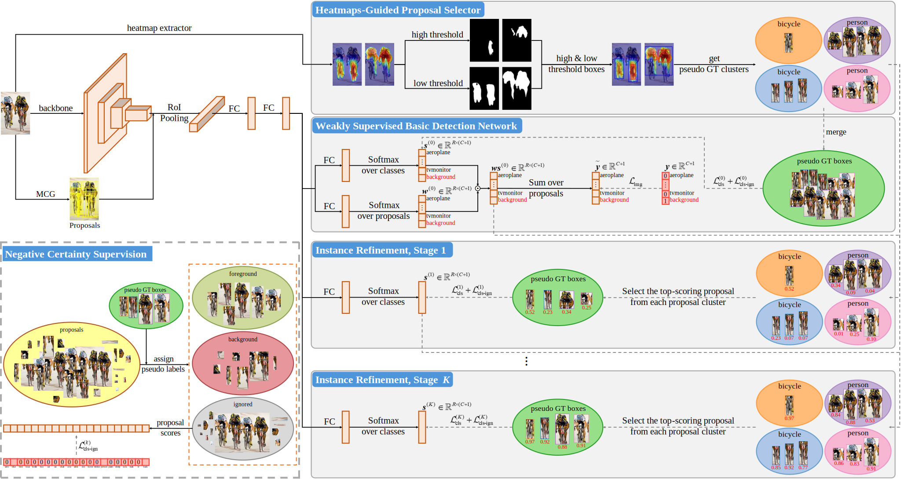

# Dual-Thresholded Heatmap-Guided Proposal Clustering and Negative Certainty Supervision with Enhanced Base Network for Weakly Supervised Object Detection

By [Yuelin Guo](https://scholar.google.com/citations?user=EZfWgzoAAAAJ), [Haoyu He](https://scholar.google.com/citations?user=aU1zMhUAAAAJ), [Zhiyuan Chen](https://scholar.google.com/citations?user=FuehZ2gAAAAJ), [Zitong Huang](https://scholar.google.com/citations?user=WHVC7kkAAAAJ), [Renhao Lu](https://scholar.google.com/citations?user=Ho-L_E8AAAAJ), [Lu Shi](https://scholar.google.com/citations?user=A_kTOV8AAAAJ), [Zejun Wang](https://scholar.google.com/citations?hl=zh-CN&user=RHyxwX4AAAAJ), and [Weizhe Zhang](https://scholar.google.com/citations?user=GOQFn7sAAAAJ).

<div style="text-align: center;">

</div>

The overview architecture of **DANCE**. **HGPS**: Given an image, category-specific heatmaps are first obtained through the heatmap extractor. Dual thresholds are then applied to generate tight bounding boxes, where proposals falling between the high and scaled low boxes are assigned to corresponding clusters as a pseudo-GT-box candidate set. During training, the top-scoring proposal within each cluster is selected to form pseudo GT boxes for adjacent modules' supervision. **WSBDN**: It extends WSDDN by incorporating a background class shape into each proposal's feature representation, and leverages merged pseudo GT boxes obtained via HGPS to impose initial constraints on its class-wise softmax branch. **NCS**: For proposals ignored after IoU-based partitioning, their scores for categories confirmed to be absent in the image are trained toward zero. All modules are used during training, while only the backbone and the $K$-th IR module are used during inference.

## Installation

### Requirements

* Ubuntu with Python ≥ 3.7
* PyTorch ≥ 1.8
* CUDA ≥ 10.1
* 4 GPUs

### Build

First, please clone this project and get into the root folder.

```
git clone https://github.com/gyl2565309278/DANCE.git
cd DANCE
```

Second, install and build this project as follows:

```
pip install -e ./ --no-build-isolation --config-settings editable_mode=compat

cd projects/WSOD/
pip install -r requirements.txt
pip install -e . --no-build-isolation --config-settings editable_mode=compat
cd ../../
```

Third, create `models/` and `output/` folders under DANCE directory.

```
mkdir models/ output/

# Or, use soft link to build the two folders:
ln -s /path/to/models/ models/
ln -s /path/to/output/ output/
```

### Files

You need to download the files for running DANCE from [here](https://pan.baidu.com/s/17Mb9SLEq6z4IJjSeIsqImg?pwd=1127) additionally, whose directory structure is like:

```
DANCE
|_ datasets
|  |_ heatmaps
|  |  |_ voc_2007_trainval_cams_d2.pkl
|  |  |_ voc_2012_trainval_cams_d2.pkl
|  |_ proposals
|  |  |_ voc_2007_trainval_mcg_hgps_proposals_d2.pkl
|  |  |_ voc_2012_trainval_mcg_hgps_proposals_d2.pkl
|_ models
|  |_ V-16.pkl
|_ output
   |_ model_final_voc07.pth
   |_ model_final_voc12.pth
```

## Dataset Preparation

Please follow [./datasets/README.md](datasets/README.md) to build datasets.

Then, create `proposals/` folder under `datasets/` directory.

```
mkdir datasets/proposals/

# Or, use soft link to build the folder:
cd datasets/
ln -s /path/to/proposals/ proposals/
cd ../
```

Next, download MCG proposals from [here](https://www2.eecs.berkeley.edu/Research/Projects/CS/vision/grouping/mcg), and transform them to pickle serialization format:

```
# Pascal VOC 2007
python projects/WSOD/tools/convert_proposals.py --dataset-name voc_2007_trainval --proposal-type mcg --proposal-dir path/to/MCG-Pascal-Main_trainvaltest_2007-boxes
python projects/WSOD/tools/convert_proposals.py --dataset-name voc_2007_test --proposal-type mcg --proposal-dir path/to/MCG-Pascal-Main_trainvaltest_2007-boxes

# Pascal VOC 2012
python projects/WSOD/tools/convert_proposals.py --dataset-name voc_2012_trainval --proposal-type mcg --proposal-dir path/to/MCG-Pascal-Main_trainvaltest_2012-boxes
python projects/WSOD/tools/convert_proposals.py --dataset-name voc_2012_test --proposal-type mcg --proposal-dir path/to/MCG-Pascal-Main_trainvaltest_2012-boxes
```

To obtain the category-specific heatmaps, you can follow [S2C](https://github.com/sangrockEG/S2C) repo, or directly use our pre-generated heatmaps for convenience.

Then, build the HGPS proposals as follows:

```
# Pascal VOC 2007
python projects/WSOD/tools/generate_hgps_proposals.py --dataset-name voc_2007_trainval --heatmap-dir path/to/DANCE/datasets/heatmaps/

# Pascal VOC 2012
python projects/WSOD/tools/generate_hgps_proposals.py --dataset-name voc_2012_trainval --heatmap-dir path/to/DANCE/datasets/heatmaps/
```

Or, directly use our pre-generated proposal files:

```
# Pascal VOC 2007
mv path/to/DANCE/datasets/proposals/voc_2007_trainval_mcg_hgps_proposals_d2.pkl datasets/proposals/

# Pascal VOC 2012
mv path/to/DANCE/datasets/proposals/voc_2012_trainval_mcg_hgps_proposals_d2.pkl datasets/proposals/
```

## Backbone Preparation

The VGG16 model pre-trained on the ImageNet dataset is used as the backbone.

Move `DANCE/models/V-16.pkl` into the `DANCE/models/` folder built just before:

```
mkdir models/detectron2/ImageNetPretrained/MSRA/
mv path/to/DANCE/models/V-16.pkl models/detectron2/ImageNetPretrained/MSRA/
```

## Getting Started

We use VOC07 as example.

For training, you can follow these commands listed below:

### DANCE

```
python projects/WSOD/tools/train_net.py --num-gpus 4 --config-file projects/WSOD/configs/PascalVOC-Detection/dance_V_16_DC5_1x.yaml OUTPUT_DIR output/dance_V_16_DC5_1x_VOC07_`date +'%Y-%m-%d_%H-%M-%S'`
```

### DANCE + Fast R-CNN

```
python projects/WSOD/tools/train_net.py --num-gpus 4 --config-file projects/WSOD/configs/PascalVOC-Detection/reg/dance_V_16_DC5_1x.yaml OUTPUT_DIR output/dance+frcnn_V_16_DC5_1x_VOC07_`date +'%Y-%m-%d_%H-%M-%S'`
```

For testing, run the following commands:

### DANCE

```
python projects/WSOD/tools/train_net.py --eval-only --num-gpus 4 --config-file projects/WSOD/configs/PascalVOC-Detection/dance_V_16_DC5_1x.yaml MODEL.WEIGHTS path/to/model_trained OUTPUT_DIR path/to/dir_desired
```

### DANCE + Fast R-CNN

```
python projects/WSOD/tools/train_net.py --eval-only --num-gpus 4 --config-file projects/WSOD/configs/PascalVOC-Detection/reg/dance_V_16_DC5_1x.yaml MODEL.WEIGHTS path/to/model_trained OUTPUT_DIR path/to/dir_desired
```

## Main Results

You can directly use our trained parameters `model_final_voc07.pth` and `model_final_voc12.pth` for testing, and get the following results:

|  Dataset | Retrain method | mAP  | mCorLoc |
|:---------|:---------------|:----:|:-------:|
| VOC2007  | DANCE          | 58.5 | 81.8    |
| VOC2012  | DANCE          | [55.6](http://host.robots.ox.ac.uk:8080/anonymous/CS4U99.html) | 80.5    |

## License

DANCE is based on [Detectron2](https://github.com/facebookresearch/detectron2) and released under the [Apache 2.0 license](LICENSE).
